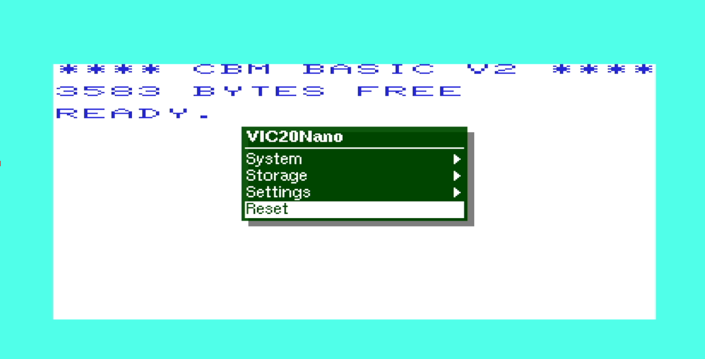

# VIC20Nano
The VIC20Nano is a port of some [MiST](https://github.com/mist-devel/mist-board/wiki) and 
[MiSTer](https://mister-devel.github.io/MkDocs_MiSTer/) components of the
[VIC20](https://en.wikipedia.org/wiki/VIC-20) for the :<br>

| Board      | FPGA       | support |Note|
| ---        |        -   | -     |-|
| [Tang Nano 9k](https://wiki.sipeed.com/hardware/en/tang/Tang-Nano-9K/Nano-9K.html)       | [GW1NR](https://www.gowinsemi.com/en/product/detail/38/)  |HDMI / LCD|no C1541, Tape, Mega-Cart <br> only 8k or 16k memory expansion<br> micro SD card [HW modification](TANG_NANO_9K.md#hw-modification) needed|
| [Tang Nano 20k](https://wiki.sipeed.com/nano20k)     | [GW2AR](https://www.gowinsemi.com/en/product/detail/38/)  |HDMI / LCD|- |
| [Tang Primer 20K Dock ext Board](https://wiki.sipeed.com/hardware/en/tang/tang-primer-20k/primer-20k.html)| [GW2A](https://www.gowinsemi.com/en/product/detail/46/)|HDMI / LCD|- |
| [Tang Primer 25K](https://wiki.sipeed.com/hardware/en/tang/tang-primer-25k/primer-25k.html) | [GW5A-25](https://www.gowinsemi.com/en/product/detail/60/)  | X |no Dualshock, no Retro D9 Joystick |
| [Tang Mega 60k NEO](https://wiki.sipeed.com/hardware/en/tang/tang-mega-60k/mega-60k.html)|[GW5AT-60](https://www.gowinsemi.com/en/product/detail/60/)| X |two Dualshock, selectable |
| [Tang Mega 138k Pro](https://wiki.sipeed.com/hardware/en/tang/tang-mega-138k/mega-138k-pro.html)|[GW5AST-138](https://www.gowinsemi.com/en/product/detail/60/) | X |two Dualshock, selectable |

<br>

Be aware that the [C64](https://en.wikipedia.org/wiki/Commodore_64) had been ported too in similar manner ([C64Nano](https://github.com/vossstef/tang_nano_20k_c64)).<br>
Also the [Atari 2600 VCS](https://en.wikipedia.org/wiki/Atari_2600) had been ported ([A2600Nano](https://github.com/vossstef/A2600Nano)).<br>

Original VIC-20 core by [MikeJ (Mike Johnson)](https://www.fpgaarcade.com/author/mikej/) and [WoS (Wolfgang Scherr)](https://www.researchgate.net/profile/Wolfgang_Scherr2)<br>
All HID, SDcard and [BL616 MCU](https://en.bouffalolab.com/product/?type=detail&id=25) µC firmware by [Till Harbaum](http://www.harbaum.org/till/mist)<br>
c1541 by [darfpga](https://github.com/darfpga)<br>

Features:
* PAL 832x576p@50Hz or NTSC 800x480p@60Hz HDMI Video and Audio Output
* TFT-LCD module 800x600 [SH500Q01Z](https://dl.sipeed.com/Accessories/LCD/500Q01Z-00%20spec.pdf) + Speaker support
* USB Keyboard via µC (Sipeed M0S Dock BL616 / Raspberry Pi Pico RP2040 / ESP32 S2/S3)
* [USB Joystick](https://en.wikipedia.org/wiki/Joystick) via µC
* [USB Mouse](https://en.wikipedia.org/wiki/Computer_mouse) via µC as [c1351](https://en.wikipedia.org/wiki/Commodore_1351) Mouse emulation
* [USB Gamepad](https://en.wikipedia.org/wiki/Gamepad) Stick via µC as [Paddle](https://www.c64-wiki.com/wiki/Paddle) Emulation<br>
* [legacy D9 Joystick](https://en.wikipedia.org/wiki/Atari_CX40_joystick) (Atari / Commodore digital type) [MiSTeryNano shield](https://github.com/harbaum/MiSTeryNano/tree/main/board/misteryshield20k/README.md)<br>
* Joystick emulation on Keyboard [Numpad](https://en.wikipedia.org/wiki/Numeric_keypad)<br>
* [Dualshock 2 Controller Gamepad](https://en.wikipedia.org/wiki/DualShock) Keys & Stick as Joystick<br>
* [Dualshock 2 Controller Gamepad](https://en.wikipedia.org/wiki/DualShock) Sticks as [Paddle](https://www.c64-wiki.com/wiki/Paddle) Emulation (analog mode)<br>
* emulated [1541 Diskdrive](https://en.wikipedia.org/wiki/Commodore_1541) on FAT/extFAT microSD card<br>
* C1541 DOS ROM selection
* Cartridge ROM (*.PRG) loader
* Direct BASIC program file (*.PRG) injection loader
* Tape (*.TAP) image loader [C1530 Datasette](https://en.wikipedia.org/wiki/Commodore_Datasette)
* Loadable 8K Kernal ROM (*.BIN)
* Mega-Cart (*.ROM) loader
* On Screen Display (OSD) for configuration and D64 image selection<br>
* 3K, 8K, 16K, 24K, 32K RAM Expansion (35k with cardtridge RAM)<br>
* 8K RAM at $A000 as loadable Cartridge Slot<br>
* RS232 Serial Interface [VIC-1011](http://www.zimmers.net/cbmpics/xother.html) to Tang onboard USB-C serial port or external hw pin.
<br>

<br>

HID interfaces aligned in pinmap and control to match [MiSTeryNano project's misterynano_fw](https://github.com/harbaum/MiSTeryNano/tree/main/firmware/misterynano_fw) respectively [FPGA-Companion](https://github.com/harbaum/FPGA-Companion).<br> Basically a µC M0S/BL616 / Raspberry Pi Pico RP2040 / ESP32-S2/S3 acts as USB host for USB devices and as an OSD controller using a [SPI communication protocol](https://github.com/harbaum/MiSTeryNano/blob/main/SPI.md).
<br>

## Installation

The installation of VIC20 Nano on the Tang Nano 20k board can be done using a Linux PC or a Windows PC
[Instruction](INSTALLATION_WINDOWS.md).<br>

## VIC20Nano on Tang Nano 9K
See [Tang Primer 9K](TANG_NANO_9K.md)

## VIC20Nano on Tang Primer 20K (Dock ext board)
See [Tang Primer 20K](TANG_PRIMER_20K.md)<br>
The DDR3 memory controller is a slight modified copy of [nestang](https://github.com/nand2mario/nestang). It had been tested on a board eqipped with a SKHynix DDR3 memory and is used as a buffer for the TAP Tape loading.

## VIC20Nano on Tang Primer 25K
See [Tang Primer 25K](TANG_PRIMER_25K.md). PMOD TF-CARD V2 is required !

## VIC20Nano on Tang Mega 60k NEO
See [Tang Mega 60K NEO](TANG_MEGA_60K.md)

## VIC20Nano on Tang Mega 138K Pro
See [Tang Mega 138K Pro](TANG_MEGA_138K.md)

## VIC20Nano with LCD and Speaker
See [Tang Nano LCD](TANG_LCD.md)

## emulated Diskdrive c1541
Emulated 1541 on a regular FAT/exFAT formatted microSD card.<br>
Copy a D64 Disk image to your sdcard and rename it to **disk8.d64** as default boot image.<br>
Add further D64 images as you like and insert card in TN/TP slot. LED 0 acts as Drive activity indicator.<br> 
> [!TIP]
Disk directory listing: [or F1 keypress in JiffyDOS]<br> 
command: <br>
LOAD"$",8<br>
LIST<br> 
Load first program from Disk: (or just LOAD if Dolphin Kernal active)<br> 
LOAD"*",8<br>
RUN<br>
JiffyDOS can be used as well known Speedloader. Change in OSD the c1541 DOS to Jiffy too.<br>

## RAM Expansion
Size and Region can be activated in several steps. A change takes effect immediately.<br>
Take care to activate the correct size of needed expansion before you load *.PRG and *.TAP !
|Expansion| $0400 3k | $2000 8k |$4000 8k |$6000 8k |$A000 8k |
| - | - | - |- |- |- |
| Block | 0 | 1 |2 |3 |Cartridge|
| 3k | x | - |- |- | |
| 8k | -  | x  |- |- | |
| 16k | -  | x |x |- | |
| 24k | -  | x  |x |x | |
| 35k | x  | x  |x |x |x|

## Cartridge ROM Loader (.PRG/.CRT)
Cartrige ROM can be loaded via OSD file selection.<br>
Be aware that the core doesn't support the [VICE EMU](https://vice-emu.sourceforge.io/vice_16.html) file format.<br>
Typical VIC20 Cartridge ROMS with ending .PRG have a two byte header indicating the loading location.<br>
8k Cartridges to be loadeded directly as such. 16k or larger Cartridges have to be loaded in several steps and the file with ending xyz-a000.prg have to be loaded last. First load xyz-2000.prg, xyz-4000.prg or xyz-6000.prg and then xyz-a000.prg at last. The Cartridge will start after that last step automatically.<br>
Copy a 8K xyz-a000.prg ROM to your sdcard and rename it to **vic20crt.crt** as default boot cartridge.<br>
> [!TIP]
**Detach Cartridge** by OSD :<br>
```temporary``` **Cartridge unload & Reset**  
```permanent``` **No Disk**, **Save settings** and System **Cold Boot**.<br>

## BASIC Program Loader (.PRG)
A BASIC Program *.PRG file can be loaded via OSD file selection.<br>
Copy a *.PRG to your sdcard and rename it to **vic20prg.prg** as default boot basic program.<br>
Prevent PRG load by OSD PRG selection **No Disk** , **Save settings** and **Reset**.<br>
> [!TIP]
Check loaded file by command: **LIST**<br>

> [!IMPORTANT]
command: **RUN**<br>

## Tape Image Loader (*.TAP)
A [Tape](https://en.wikipedia.org/wiki/Commodore_Datasette) *.TAP file can be loaded via OSD file selection<br>
In order to start a tape download choose VIC20 CBM Kernal (mandatory as JiffyDOS doesn't support Tape). Best to save Kernal OSD selection via **Save settings**.<br>
> [!IMPORTANT]
command: **LOAD**<br>

The file is loaded automatically as soon as TAP file selected via OSD (no need to press PLAY TAPE button) in case ***no** TAP had been previously selected*.<br>
After some seconds the filename of the to be loaded file will be shown and it will take time...<br>
Copy a *.TAP to your sdcard and rename it to **vic20tap.tap** as default tape mountpoint.<br>
For **Tape unload** use OSD TAP selection **No Disk** and **Reset** or System **Cold Boot**.<br>
> [!WARNING]
After board power-up or coldboot a TAP file will **not autoloaded** even if TAP file selection had been saved or c64tap.tap mountpoint available !<br>
Unblock loader by OSD TAP selection **No Disk** or simply select again the desired TAP file to be loaded after you typed **LOAD**<br>

> [!TIP]
Check loaded file by command: **LIST**<br>

> [!IMPORTANT]
command: **RUN**<br>

> [!NOTE]
The available (muffled) Tape Sound audio can be disabled from OSD.<br>

## Kernal Loader (.BIN)
The CBM factory PAL type is the power-up default Kernal.<br>
> [!TIP]
If you are fine with that then there is no need to load another Kernal via OSD and just select OSD Kernal BIN selection **No Disk** and **Save settings**!<br>

Kernal ROM files *.BIN can be loaded via OSD selection (e.g. JiffyDOS VIC20).<br>
Copy a 8K VIC20 Kernal ROM *.BIN to your sdcard and rename it to **vic20kernal.bin** as default boot Kernal.<br>
Prevent Kernal load by OSD Kernal BIN selection **No Disk** and **Save settings** and do a **power-cyle** of the board.<br>

## loadable Cartridge RAM Slot
Some Cartridge based games can be be simply loaded from a [VIC20](https://vic20reloaded.com) D64 Disk Image.<br>
Example: 16 k Cartridge Game<br>
Enable RAM Expansion at $2000 (or $6000) and Cartridge region $A000<br>
Leave OSD setting CRT writeable setting as enabled as first approach.
Save setting and do a Cold Boot Reset.<br>
``` LOAD "xyz.200",8,1```   (Block 1)<br>
``` or LOAD "xyz.600",8,1```   (Block 3)<br>
``` LOAD "xyz.A00",8,1```   (Block 5)<br>
Start Game by command: SYS40960 (general start Address for Cartridge Slot)<br> or better perform a Reset via OSD.<br>
There are also some cartridge games on D64 Image with a loader that themselves further reload the needed RAM regions and autostart (you have to activate RAM regions beforhand).<br> A loaded Cartridge can be exited by disabling memory region $A000 + Cold Reset via OSD. In order to trial another game just activate again (after reset !) the $A000 memory and load another game.

## Mega-Cart (.ROM)
The 2MB [Mega-Cart](https://www.retroisle.com/commodore/vic20/Articles/megacart.php) *.ROM can be loaded via OSD file selection. <br>
If the Mega-Cart is used, then managing the RAM expansion configuration is done in its menu. NVRAM is not supported.

## Core Loader Sequencing
The core will after power cycle/ cold-boot start downloading the images on the sdcard in the following order:
> [!NOTE] 
(1) BIN Kernal, (2) CRT ROM, (3) PRG Basic.<br>

## Push Button / DIP Switch utilization
* Nano 20k S2 keep pressed during power-up for FLASH programming of FPGA bitstream<br>
* Primer 20k: There is by default unfortunately no Button/Switch to prevent FPGA bitstream load from FLASH (see rework how to add).
* Mega 60k NEO ```SW1 ON``` ```SW6 ON``` + Press & **Hold** ```RECONFIG``` + Power the Board + release ```RECONFIG``` and perform programming.
> [!CAUTION]
A FLASH programm attempt without keeping the board in reset may lead to corruption of the C1541 DOS images stored in FLASH requiring re-programming.


* **S1** reserved <br>

## OSD
invoke by F12 keypress<br>
* Reset<br>
* Cold Reset<br>
* Audio Volume + / -<br>
* Scanlines effect %<br>
* Widescreen activation<br>
* Screen centering<br>
* PAL / NTSC Video mode<br>
* HID device selection for Joystick Port<br>
* RAM Expansion $A000(8k), $6000(8k), $4000(8k), $2000(8k), $0400(3k)<br>
* Cartridge Write protection<br>
* c1541 Drive disk image selection<br>
* c1541 Disk write protetcion<br>
* c1541 Reset<br>
* c1541 DOS ROM selection<br>
* Loader (CRT/PRG/BIN/TAP/ROM) file selection<br>
* Cartridge unload

## Gamecontrol support
legacy single D9 Digital Joystick. OSD: **Retro D9**<br>
or<br>
USB Joystick(s). OSD: **USB #1 Joy** or **USB #2 Joy** <br>
or<br>
Gamepad Stick as Joystick. OSD: **DualShock2**
<br>**stick digital** for Move and Left **L1** or Right **R1** shoulder Button for Trigger or following **Pad** controls:<br>
| Buttons | - | - |
| - | - | -  |
| Left L1/R1<br>Trigger | triangle button<br>Up  | .  |
| square button<br>Left | - | circle button<br>Right |
| - | cross button<br>Down | - |<br>

or Keyboard Numpad. OSD: **Numpad**<br>
| | | |
|-|-|-|
|0<br>Trigger|8<br>Up|-|
|4<br>Left|-|6<br>Right|
|-|2<br>Down|-|

or Mouse. OSD: **Mouse**<br>
USB Mouse as c1351 Mouse emulation.

or Dualshock2 Gamepad as Paddle. OSD: **DS2 Paddle**<br>
Dualshock 2 Sticks in analog mode as VC-1312 Paddle emulation.<br>
Left **L1 / L2**  and Right **R1 / R2** shoulder Button as Trigger<br>
You have first to set the DS2 Sticks into analog mode by pressing the DS2 ANALOG button. Mode indicated by red light indicator.<br>Configure DIGITAL mode (press ANALOG button again) when using the **Joystick** mode again and set OSD: **DualShock**<br>

or USB Paddle. OSD: **USB #1 Padd** or **USB #2 Padd** <br>
Left Stick in X / Y analog mode as VC-1312 Paddle emulation.<br>
Button **1 / 2** as Trigger<br>

## Keyboard 
 
 Tape Play not implemented.

## LED UI

| LED | function        | TN20K | TP20K | TP25K |TM60k     |TM138K Pro |TN9k|
| -   |        -        | -     |-      | -     |-         |-          |-   |
| 0   | c1541 activity  | x     |x      |  x    |x (done)  |x          |N/A |
| 1   | D64 selected    | x     |x      |  x    |x (ready) |x          |N/A |
| 2   | CRT seleced     | x     |x      | -     |-         |x          |x   |
| 3   | PRG selected    | x     |x      | -     |-         |x          |x   |
| 4   | Kernal selected | x     |x      | -     |-         |x          |x   |
| 5   | TAP selected    | x     |x      | -     |-         |x          |N/A |

Solid **<font color="red">red</font>** of the c1541 led after power-up indicates a missing DOS in Flash<br>

**Multicolor RGB LED**
* **<font color="green">green</font>**&ensp;&thinsp;&ensp;&thinsp;&ensp;&thinsp;all fine and ready to go<br>
* **<font color="red">red</font>**&ensp;&thinsp;&ensp;&thinsp;&ensp;&thinsp;&ensp;&thinsp;&ensp;&thinsp;something wrong with SDcard / default boot image<br>
* **<font color="blue">blue</font>**&ensp;&thinsp;&ensp;&thinsp;&ensp;&thinsp;&ensp;&thinsp;µC firmware detected valid FPGA core<br>
* **<font color="yellow">yellow</font>**&ensp;&thinsp;&ensp;&thinsp;&ensp;&thinsp;FPGA core can't detect valid firmware<br>
* **white**&ensp;&thinsp;&ensp;&thinsp;&ensp;&thinsp;-<br>
## RS232 Serial Interface 
The Tang onboard USB-C serial port can be used for communication with the Userport Serial port [VIC-1011](http://www.zimmers.net/cbmpics/xother.html).<br>
Terminal programs need the Kernal serial routines therefore select via OSD the CBM Kernal.<br> For a first start use 1200Baud and a Terminal program like [VIC term](https://github.com/sblendorio/victerm300) and on the PC side [Putty](https://www.putty.org).<br>
OSD selection allows to change in between TANG USB-C port or external HW pin interface.<br>

| Board      |RX (I) FPGA |TX (O) FPGA|Note|
|  -         |   -    |   -  | -   |
| TN20k      |31      | 77   |[pinmap](https://wiki.sipeed.com/hardware/en/tang/tang-nano-20k/nano-20k.html#Pin-diagram), misterynano io(6) / io(7)|
| TP25k      |K5      | L5   | J4-6  J4-5, share M0S Dock PMOD|
| TM60k NEO  |AB20    | AA19 | J24-6 J24-5, share M0S Dock PMOD |
| TM138k Pro |H15     | H14  | J24-6 J24-5, share M0S Dock PMOD |

Remember that in + out to be crossed to connect to external device. Level are 3V3 tolerant.

## Powering
Prototype circuit with Keyboard can be powered by Tang USB-C connector from PC or a Power Supply Adapter. 
## Synthesis
Source code can be synthesized, fitted and programmed with GOWIN IDE Windows or Linux.<br>
Alternatively use the command line build script **gw_sh.exe** build_tn20k.tcl, build_tp20k.tcl or build_tp25k.tcl<br>
## Pin mapping 
see pin configuration in .cst configuration file
## HW circuit considerations
**Pinmap TN20k Interfaces** <br>
 Sipeed M0S Dock, digital Joystick D9 and DualShock Gamepad connection.<br>
 

**Pinmap D-SUB 9 Joystick Interface** <br>
- Joystick interface is 3.3V tolerant. Joystick 5V supply pin has to be left floating !<br>


| Joystick pin |IO| Tang Nano pin | FPGA pin | Joystick Function |
| ----------- |-----| ---   | --------  | ----- |
| 1 |2| J6 10  | 25   | UP | 
| 2 |1| J6 9  | 28 | DOWN |
| 3 |4| J6 12 | 29 | LEFT |
| 4 |3| J5 11 | 26 | RIGHT |
| 5 |-| - | - | POT Y | - |
| 6 |0| J5 8 | 27 | TRIGGER|
| 7 |-| n.c | n.c | 5V | - |
| 8 |-| J5 20 | - | GND | - |
| 9 |-| - | - | POT X | - |

**Pinmap Dualshock 2 Controller Interface** <br>

| DS pin | Tang Nano pin | FPGA pin | DS Function |
| ----------- | ---   | --------  | ----- |
| 1 | J5 18 | 71 MISO | JOYDAT  |
| 2 | J5 19 | 53 MOSI  | JOYCMD |
| 3 | n.c. | - | 7V5 |
| 4 | J5 15 | - | GND |
| 5 | J5 16| - | 3V3 |
| 6 | J5 17 | 72 CS | JOYATN|
| 7 | J5 20 | 52 MCLK | JOYCLK |
| 8 | n.c. | - | JOYIRQ |
| 9 | n.c. | - | JOYACK |


## Getting started

In order to use this Design the following things are needed:

[Sipeed M0S Dock](https://wiki.sipeed.com/hardware/en/maixzero/m0s/m0s.html) or Raspberry Pi Pico RP2040 or ESP32-S2/S3<br>
[Sipeed Tang Nano 20k](https://wiki.sipeed.com/nano20k) <br>
or [Sipeed Tang Primer 25k](https://wiki.sipeed.com/hardware/en/tang/tang-primer-25k/primer-25k.html)<br>
and [PMOD DVI](https://wiki.sipeed.com/hardware/en/tang/tang-PMOD/FPGA_PMOD.html#PMOD_DVI)<br>
and [PMOD TF-CARD V2](https://wiki.sipeed.com/hardware/en/tang/tang-PMOD/FPGA_PMOD.html#PMOD_TF-CARD)<br>
and [SDRAM](https://wiki.sipeed.com/hardware/en/tang/tang-PMOD/FPGA_PMOD.html#TANG_SDRAM)<br>
and [M0S PMOD adapter](https://github.com/harbaum/MiSTeryNano/tree/main/board/m0s_pmod/README.md)
 or ad hoc wiring + soldering.<br>
or [Tang Primer 20K with Dock ext Board](https://wiki.sipeed.com/hardware/en/tang/tang-primer-20k/primer-20k.html)<br>
and [M0S PMOD adapter](https://github.com/harbaum/MiSTeryNano/tree/main/board/m0s_pmod/README.md).<br>
and [PMOD DS2x2](https://wiki.sipeed.com/hardware/en/tang/tang-PMOD/FPGA_PMOD.html#PMOD_DS2x2)<br>
or [Tang Nano 9K](https://wiki.sipeed.com/hardware/en/tang/Tang-Nano-9K/Nano-9K.html)<br>
or [Sipeed Tang Mega 138k Pro](https://wiki.sipeed.com/hardware/en/tang/tang-mega-138k/mega-138k-pro.html)<br>
and [SDRAM](https://wiki.sipeed.com/hardware/en/tang/tang-PMOD/FPGA_PMOD.html#TANG_SDRAM)<br>
and [PMOD DS2x2](https://wiki.sipeed.com/hardware/en/tang/tang-PMOD/FPGA_PMOD.html#PMOD_DS2x2)<br>
and [M0S PMOD adapter](https://github.com/harbaum/MiSTeryNano/tree/main/board/m0s_pmod/README.md)<br>
or [Tang Mega 60K NEO](https://wiki.sipeed.com/hardware/en/tang/tang-mega-60k/mega-60k.html)<br>
and [SDRAM](https://wiki.sipeed.com/hardware/en/tang/tang-PMOD/FPGA_PMOD.html#TANG_SDRAM)<br>
and [PMOD DS2x2](https://wiki.sipeed.com/hardware/en/tang/tang-PMOD/FPGA_PMOD.html#PMOD_DS2x2)<br>
and [M0S PMOD adapter](https://github.com/harbaum/MiSTeryNano/tree/main/board/m0s_pmod/README.md)<br>

microSD or microSDHC card FAT/exFAT formatted<br>
TFT Monitor with HDMI Input and Speaker<br>
<br>

| HID and Gamecontrol Hardware option | TN20k needs | alternative option |Primer 25K|Mega 60K|Mega 138K|
| -----------                         | ---         | ---                | ---      | -      | -       |
| USB Keyboard | [USB-C to USB-A adapter](https://www.aliexpress.us/item/3256805563910755.html) | [4 port mini USB hub HS8836A](https://a.aliexpress.com/_EIidgjH)  |x|x|x|
| [USB Joystick(s)](https://www.speedlink.com/en/COMPETITION-PRO-EXTRA-USB-Joystick-black-red/SL-650212-BKRD)| [4 port mini USB hub HS8836A](https://a.aliexpress.com/_EIidgjH) | - |x|x|x|
| USB Mouse   | [4 port mini USB hub HS8836A](https://a.aliexpress.com/_EIidgjH)  | -  |x|x|x|
| USB Gamepad |[4 port mini USB hub HS8836A](https://a.aliexpress.com/_EIidgjH)  | -  |x|x|x|
| Commodore/[Atari](https://en.wikipedia.org/wiki/Atari_CX40_joystick) compatible retro D9 Joystick| [MiSTeryNano shield](https://github.com/harbaum/MiSTeryNano/tree/main/board/misteryshield20k/README.md)|D-SUB 9 M connector, breadboard to wire everything up, some jumper wires|-|adhoc SDRAM1 Joy D9|adhoc PMOD Joy D9|
| [Dualshock 2 Controller Gamepad](https://en.wikipedia.org/wiki/DualShock) | Gamepad Adapter Board (Sipeed Joystick to DIP) respectively<br> PMOD DS2x2 | breadboard to wire everything up and some jumper wires |-|PMOD DS2x2|PMOD DS2x2|