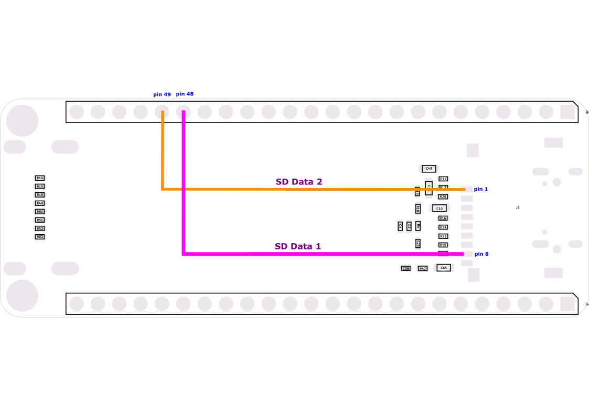

# VIC20Nano on Tang Nano 9K

VIC20Nano can be used in the [Tang Nano 9k](https://wiki.sipeed.com/hardware/en/tang/Tang-Nano-9K/Nano-9K.html).

The whole setup will look like this: 

|Bus|Signal| D9  |TN9k| FPGA Signal    |
| - |------|-------------------|-|-------|
| 0 | Trigger | -    |x|  x      |
| 1 | Down    | -    |y|  y      |
| 2 | Up      | -    |z|  z      |
| 3 | Right   | -    | |        |
| 4 | Left    | -    | |        |
| - | GND     | -    | |  GND      |

|Bus|M0S Signal| M0S Dock   |PN9k| FPGA Signal                  |                                      |
| - |------|-------------------|-|-------------------|--------------------------------------|
| - | +5V  | +5V    |-|  5V       |               |
| - | +3V3 | +3V3   |-|  n.c      | don't connect |
| - | GND  | GND    |-|  GND      | GND           |
| - | GND  | GND    |-|  GND      | GND           |
| 5 |  -   | -      |-|  x       | don't connect |
| 4 | IRQn | GPIO14 |-|  y       | Interrupt from FPGA to MCU|
| 3 | SCK  | GPIO13 |-|  z       | SPI clock, idle low       |
| 2 | CSn  | GPIO12 |-|         | SPI select, active low    |
| 1 | MOSI | GPIO11 |-|         | SPI data from MCU to FPGA |
| 0 | MISO | GPIO10 |-|         | SPI data from FPGA to MCU |

On the software side the setup is very simuilar to the original Tang Nano 20K based solution. The core needs to be built specifically
for the different FPGA of the Tang Primer using either the [TCL script with the GoWin command line interface](build_tn9k.tcl) or the
[project file for the graphical GoWin IDE](vic20nano_tn9k.gprj). The resulting bitstream is flashed to the TP20K as usual. So are the c1541 DOS ROMs which are flashed exactly like they are on the Tang Nano 20K. And also the firmware for the M0S Dock is the [same version as for
the Tang Nano 20K](https://github.com/harbaum/MiSTeryNano/tree/main/firmware/misterynano_fw/). 

  
**Mandatory !!! ** HW modifications TN9K to fully support the micro SD Card. 
Rework place with Microscope needed. 
- **SD Card Data 1** Wire tbd. SPI LCD interface will be sacrificed. 
- **SD Card Data 2** Wire tbd. SPI LCD interface will be sacrificed. 

