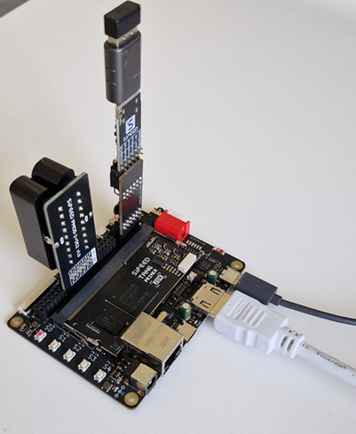
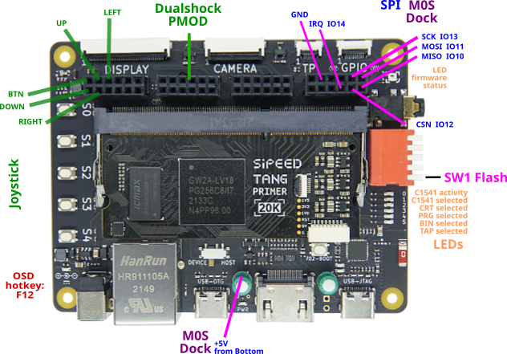
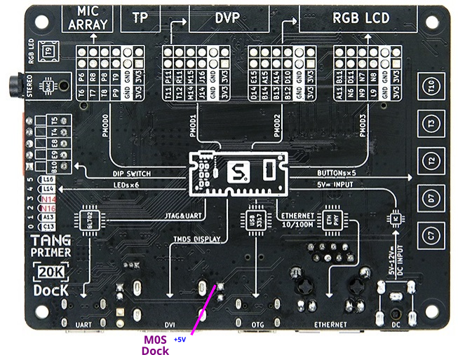

# VIC20Nano on Tang Primer 20K

VIC20Nano can be used in the [Tang Primer 20K with Dock ext Board](https://wiki.sipeed.com/hardware/en/tang/tang-primer-20k/primer-20k.html).

The M0S required to control the VIC20Nano is to be mounted in the **PMOD 0** slot (MIC ARRAY) with the help of the [M0S PMOD adapter](https://github.com/harbaum/MiSTeryNano/tree/main/board/m0s_pmod/README.md). 

Plug the optional Dualshock DS2x2 Interface into **PMOD 2** slot (RGB LCD 1).
[PMOD DS2x2](https://wiki.sipeed.com/hardware/en/tang/tang-PMOD/FPGA_PMOD.html#PMOD_DS2x2) 

The **PMOD 3** (RGB LCD 2) slot is allocated for a digital retro Joystick interface.
There is no D9 digital Joystick interface PMOD Adapter known and adhoc wiring needed.

|Bus|Signal| D9  |Primer PMOD| FPGA Signal    |
| - |------|-------------------|-|-------|
| 0 | Trigger | -    |12|  B11      |
| 1 | Down    | -    |11|  A11      |
| 2 | Up      | -    |19|  D11      |
| 3 | Right   | -    | 9|  N6      |
| 4 | Left    | -    | 8|  N7      |
| - | GND     | -    | 3|  GND      |

Mind direction !

The whole setup will look like this: 

If you don't have a **M0S PMOD adapter** at hand then adhoc wiring is feasible needing a soldering iron. 
The needed +5V for the M0S Dock can be taken from C3+ Pad by a short soldered wire.  8 single pins are needed to plug into the PMOD apart from the cable that comes along with the M0S Dock package. 

|Bus|M0S Signal| M0S Dock   |Primer PMOD| FPGA Signal                  |                                      |
| - |------|-------------------|-|-------------------|--------------------------------------|
| - | +5V  | +5V    |-|  n.c      | C3+ Pad !!! +5V Supply for M0S              |
| - | +3V3 | +3V3   |-|  n.c      | don't connect |
| - | -    | -      |-|  +3V3     | don't connect |
| - | -    | -      |-|  +3V3     | don't connect |
| - | GND  | GND    |-|  GND      | GND           |
| - | GND  | GND    |-|  GND      | GND           |
| - |  -   | -      |-|  T9       | don't connect |
| - |  -   | -      |-|  P9       | don't connect |
| 5 |  -   | -      |-|  P8       | don't connect |
| 4 | IRQn | GPIO14 |-|  T8       | Interrupt from FPGA to MCU|
| 3 | SCK  | GPIO13 |-|  R8       | SPI clock, idle low       |
| 2 | CSn  | GPIO12 |-|  T7       | SPI select, active low    |
| 1 | MOSI | GPIO11 |-|  P6       | SPI data from MCU to FPGA |
| 0 | MISO | GPIO10 |-|  T6       | SPI data from FPGA to MCU |

 

For 20K Dock kits, it's necessary to enable the FPGA configuration mode before using the Programmer, just put the 1 switch on the dip switch down.  

On the software side the setup is very simuilar to the original Tang Nano 20K based solution. The core needs to be built specifically
for the different FPGA of the Tang Primer using either the [TCL script with the GoWin command line interface](build_tp20k.tcl) or the
[project file for the graphical GoWin IDE](vic20nano_tp20k.gprj). The resulting bitstream is flashed to the TP20K as usual. So are the c1541 DOS ROMs which are flashed exactly like they are on the Tang Nano 20K. And also the firmware for the M0S Dock is the [same version as for
the Tang Nano 20K](https://github.com/harbaum/MiSTeryNano/tree/main/firmware/misterynano_fw/). Latest binary can be found in the [release](https://github.com/harbaum/MiSTeryNano/releases) section.

  
**Optional !!!** HW modifications Primer 20K SO-DIMM Module that had been used during design debug. Not needed for normal operation. Rework place with Microscope needed. 
- optional: *Access FLASH WP* Wire FLASH pin 3 WP to Q1 Gate / R25 (FPGA pin P12). SPI LCD interface will be sacrificed. 
- optional: *Access FLASH HOLD*  Wire FLASH pin 7 HOLD to R26-1&2 (FPGA pin F12). SPI LCD interface will be sacrificed. 
- optional: *Prevent FPGA booting bitstream from FLASH*  
Trace cut of pin 96 signal RECFGn from SO-DIMM connector finger pad. (be very very careful)  
Wire FPGA signal MODE1 available at pad of R29 (signal side) to SO-DIMM pin 96 Pad. 
By that Dock SW1 position ON (logic high) will prevent booting bitstream from FLASH. For normal boot from Flash SW1 has to be in OFF (logic low) position. FPGA load from SRAM (Programmer) is in any position possible. Solves issue [see also](https://wiki.sipeed.com/hardware/en/tang/tang-primer-20k/primer-20k.html#Successfully-burned-once%2C-but-can%27t-burn-after-that) 